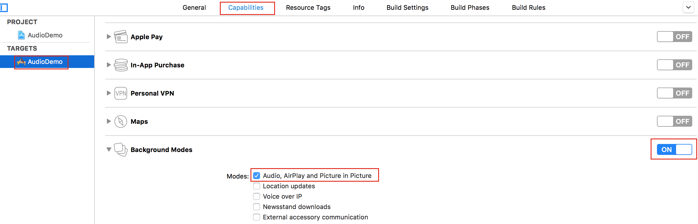
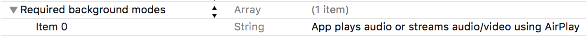
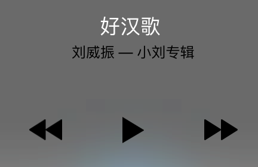

# ZZAudioDemo
音乐播放

AVAudioPlayer和AVAudioRecorder不支持流式。在播放音频前，必须等到整个音频加载完成后，才能开始播放；录音时，也必须等到录音结束后，才能获取到录音数据。本Demo尚未支持远程音频播放，共同开发中...

###支持后台播放
如果不支持后台播放，当用户按Home键后，正在播放的音频文件就会暂停播放，使程序支持后台播放的流程如下：  
1> 真机（模拟器有可能出问题）  

2> TARGET -> Capabilities -> Background Modes -> On 并且勾选Audio, … 

这样勾选了之后，在Info.plist中我们会发现：

如果没有这一项，则手动加上。  

3> 开启音频会话(单例)  
比如写在这里：

```
- (BOOL)application:(UIApplication *)application didFinishLaunchingWithOptions:(NSDictionary *)launchOptions {
    [self supportBackgroundAudioPlay];
    return YES;
}

- (void)supportBackgroundAudioPlay {
    AVAudioSession *session = [AVAudioSession sharedInstance];
    [session setActive:YES error:nil];
    [session setCategory:AVAudioSessionCategoryPlayback error:nil];
}

```

4> 显示锁屏状态下音乐播放信息（图片，歌曲信息）
首先，导入库和头文件 MediaPlayer.framework 

```
#import <MediaPlayer/MediaPlayer.h>
// 后台播放信息显示
- (void)configNowPlayingInfoCenter {
    if (NSClassFromString(@"MPNowPlayingInfoCenter")) { // 类MPNowPlayingInfoCenter是否存在，因为这个类是5.0之后出现的
        // NSLog(@"OK, have this class");
        
        NSMutableDictionary *dict = [[NSMutableDictionary alloc] init];
        [dict setObject:@"好汉歌" forKey:MPMediaItemPropertyTitle];        // 歌曲名
        [dict setObject:@"刘威振" forKey:MPMediaItemPropertyArtist];       // 歌首，艺术家
        [dict setObject:@"小刘专辑" forKey:MPMediaItemPropertyAlbumTitle]; // 专辑名
   
        UIImage *image = [_currentAudioItem image];
        MPMediaItemArtwork *artwork = [[MPMediaItemArtwork alloc] initWithImage:image];
        [dict setObject:artwork forKey:MPMediaItemPropertyArtwork];
        [[MPNowPlayingInfoCenter defaultCenter] setNowPlayingInfo:dict];
        
        [[UIApplication sharedApplication] beginReceivingRemoteControlEvents];
    }
}
```



5> 在锁屏状态下响应点击按钮事件

```
- (BOOL)canBecomeFirstResponder {
    return YES;
}

- (void)remoteControlReceivedWithEvent:(UIEvent *)event {
    if (event.type == UIEventTypeRemoteControl) {
        switch (event.subtype) {
            case UIEventSubtypeRemoteControlPause: { // 暂停
                [self pause:nil];
            }
                break;
            case UIEventSubtypeRemoteControlPlay: { // 播放
                [self play:nil];
            }
                break;
            case UIEventSubtypeRemoteControlNextTrack: { // 下一首
                [self nextSong:nil];
            }
                break;
            case UIEventSubtypeRemoteControlPreviousTrack: { // 上一首
                [self previousSong:nil];
            }
                break;
            default:
                break;
        }
    }
}

```

项目主界面  


另外，我们知道一般锁屏时播放器会在后台显示歌词，这是通过切换图片展示的（这样真的好吗？目前没有找到其他解决方法），详情看项目代码


